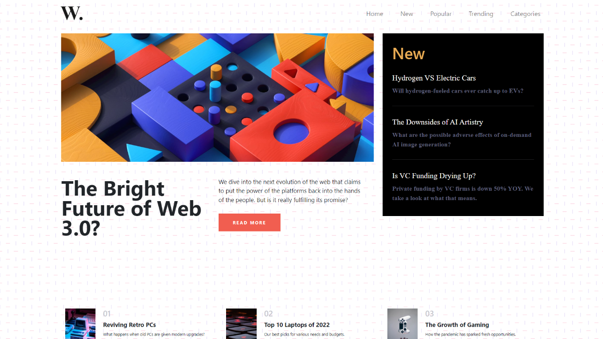

# Question 8
## Main Preview

# Task 1
## Making scrolling sidebar

// Adding scroll in sidebar

let aside = document.querySelector(".new");
aside.style.overflowY = "scroll";

// Adding content in sidebar

let addHr = document.createElement("hr");
addHr.classList.add("hr-line");
aside.appendChild(addHr);

let addH2 = document.createElement("h2");
addH2.classList.add("new-head");
let addH2Txt = document.createTextNode("The Downsides of AI Artistry");
addH2.appendChild(addH2Txt);

aside.appendChild(addH2);

let addP = document.createElement("p");
addP.classList.add("new-p");
let addPtxt = document.createTextNode(
  "What are the possible adverse effects of on-demand AI image generation?"
);
addP.appendChild(addPtxt);

aside.appendChild(addP);

# Task 2
## Change background

let bgc = document.querySelector("body");
bgc.style.background = "#fff";
# Task 3
## Create responsive nav menu

// Nav menu

let navIcon = document.querySelector("nav button span");

navIcon.addEventListener("click", (click) => {
  let navItems = document.querySelector("#navbarTogglerDemo01");
  if ((navItems.style.display = "none")) {
    navItems.style.display = "block";
  } else if ((navItems.style.display = "block")) {
    navItems.style.display = "none";
  } else {
    navItems.style.display = "none";
  }
});
